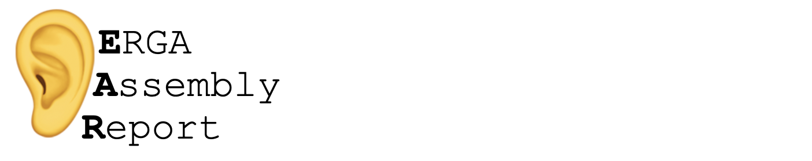

Here you will find genome assembly reports approved by the [ERGA Sequencing and Assembly Committee](https://www.erga-biodiversity.eu/team-1/sac---sequencing-and-assembly-committee) and instructions on **how to create one to get your assembly reviewed and approved to upload to ENA**.

### Assessing your assembly after manual curation

After completing the [genome assembly pipeline](https://workflowhub.eu/projects/163#workflows) to obtain the final pre-curated assembly of your species of interest, and posteriorly [producing the manually curated version](https://gitlab.com/wtsi-grit/rapid-curation/-/blob/main/RAPID%20CURATION%20TRAINING%20MANUAL.pdf?ref_type=heads) of it, please generate the corresponding ERGA Assembly Report (EAR) to get the _go-ahead_ to [upload the assembly to ENA](https://github.com/ERGA-consortium/ERGA-submission).

[The report is a PDF file](example/Elephas_maximus/mEleMax1.2/mEleMax1.2_EAR.pdf) showing relevant information of the pre/post assembly curation process that reviewers will use to confirm that the assembly meets the desired quality metrics taking into consideration pecualiarities of each case.

The review takes place inside a Pull Request specific for each assembly, openly and interactively, providing full transparency. When the report is approved, the assembly will be ready to upload to ENA, and the PDF will be part of the ERGA stable repository of reviewed assemblies, ready to be linked as needed.

 

### Please visit the[👂Wiki](https://github.com/ERGA-consortium/EARs/wiki) for detailed information on how to produce the report and start the reviewing process

 

---

⚠️ If you have problems creating the EAR or during the pull request, please write an issue to open a communication channel.
