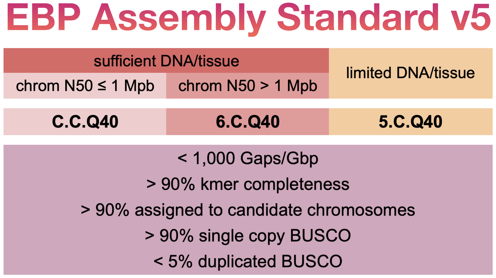
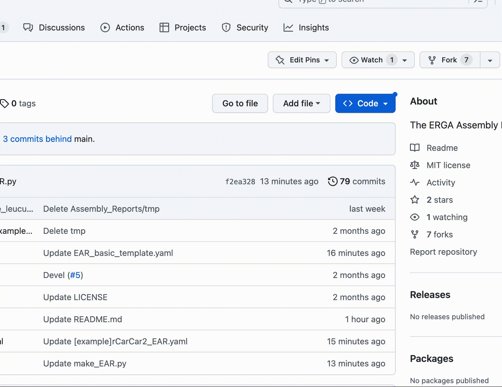
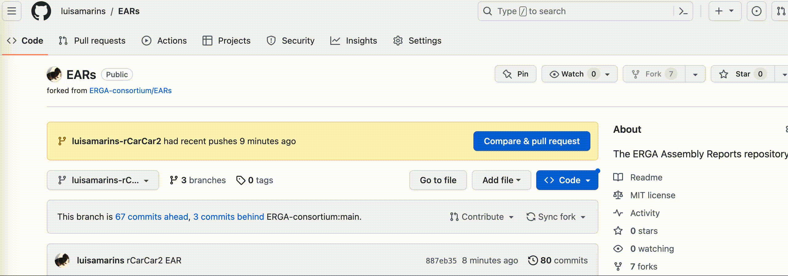

# EAR 👂 (ERGA Assembly Report)

Here you will find assembly reports approved by the [ERGA Sequencing and Assembly Committee](https://www.erga-biodiversity.eu/team-1/sac---sequencing-and-assembly-committee) and instructions on **how to create one to get your assembly reviewed and approved to upload to ENA**.


### Assessing your assembly after manual curation

After completing the [assembly pipeline](https://github.com/ERGA-consortium/pipelines) to obtain the final pre-curated assembly of your species of interest, and posteriorly [producing the manually curated version]() of it, please generate the corresponding ERGA Assembly Report (EAR) to get the _go-ahead_ to [upload to assembly to ENA]().

[The report is a PDF file](example/Elephas_maximus/mEleMax1.2/mEleMax1.2_EAR.pdf) showing relevant information of the pre/post assembly curation process that reviewers will use to confirm that the assembly meets the desired quality metrics taking into consideration pecualiarities of each case:




Which results do I need for the EAR?
- [Genomescope](https://github.com/tbenavi1/genomescope2.0) (mandatory) and [Smudgeplot](https://github.com/KamilSJaron/smudgeplot) (optional, but recommended) from your WGS accurate reads.
- [gfastats](https://github.com/vgl-hub/gfastats), [Merqury](https://github.com/marbl/merqury) and [BUSCO](https://gitlab.com/ezlab/busco) results for **complete** -pseudo-haplotypes (i.e., Hap1, Pri, collapsed, and also Hap2 if avaialble) of the final pre and post-curation steps.
- HiC contact maps for final post-curation -pseudo-haplotype(s) ([Pretext]() or [HiGlass]()): a PNG snapshot and a link for the .pretext or .mcool files uploaded to the cloud (e.g., Nextcloud, Genomeark, etc).
- [Blobplot]() PNG snapshot for contamination screening for final post-curation -pseudo-haplotype(s).
- Notes (text) you have taken about the decontamination process, presence of plastids or symbionts, sample characteristics and quality, the curation process, observed haploid number, sex, etc.


## Getting there is a two-part job:

### 1. Creating your EAR

We provide three options to produce the EAR:
1. If you have the required results, you can complete the YAML file (take a look at [EAR_basic_template.yaml](EAR_basic_template.yaml) and [mEleMax1.2_EAR.yaml](example/mEleMax1.2_EAR.yaml) files) and run the `make_EAR.py` script. We recommend installing the provided conda environment to handle the program's requirements easily.

```bash
# Clone this repository to obtain all the required files
git clone https://github.com/ERGA-consortium/EARs.git

# Create the EAR environment to run the script
conda env create -f EAR_env.yml

# Filling the YAML file for your species: Using a text editor, add the values and paths of your species and the entire assembly process in the YAML file.
# Please use as a guide the example files EAR_basic_template.yaml and example/mEleMax1.2_EAR.yaml

# Run the script to obtain the EAR pdf
python make_EAR.py mySpecies_EAR.yaml
```

2. [in preparation] Using the [snakemake-based tool GEP](https://git.imp.fu-berlin.de/begendiv/gep). By means of this pipeline, you can run all the analysis in one take for pre and post-curation -pseudo-haplotype(s) (with the only exception of contamination Blobplot) and obtain the YAML file to run the `make_EAR.py` script with minimal manual inputs (before running the script, you would only need to edit the YAML file to enter information like name and affiliation, Blobplot PNG, contact maps link in the web, and curation notes). Remember to run with `--config EAR=True`, for instance (in this case using Slurm in a computer cluster):
```bash
nohup snakemake --profile SUBMIT_CONFIG/slurm/ --config EAR=True &
```   
  
3. [in preparation] Using the [Galaxy ERGA Assembly Review (EAR) Analysis + Report workflow]().
If you are not already using Galaxy to produce your genome assembly, you will need to [create a Galaxy account](https://usegalaxy.eu/login/start?redirect=None) (with enough space, you can [request the necessary quota for your project](https://docs.google.com/forms/d/e/1FAIpQLSf9w2MOS6KOlu9XdhRSDqWnCDkzoVBqHJ3zH_My4p8D8ZgkIQ/viewform)) and upload all your assemblies and reads (WGS accurate reads for Kmer database creation and HiC for contact map). 


### 2. Getting your assembly reviewed using the EAR

Fork this repository.



Prepare a folder and subfolder with your species name and ToLID, respectively, to place your EAR pdf. Upload that inside the Assembly_Reports folder (the result will be, e.g.: `Assembly_Reports/Caretta_caretta/rCarCar2/rCarCar2_EAR.pdf`). **Important!** Do the upload to a new branch specific to this EAR (see example below). If you want to submit more than one species, you need to have one branch per each.


Create a pull request so the reviewers can assess your assembly using the EAR. **Important!** Remember to add a description to your pull request message, e.g.:
```
Species: Caretta caretta
Taxa: Testudines
Project: ERGA-testing
```



- If everything looks good, the assembly will be approved to continue the uploading to ENA under the ERGA project umbrella, and the EAR will be part of the stable ERGA repository of reports.

- If the reviewer thinks something should be clarified, addressed or corrected, it will be requested through the communication channel open during the pull request.

---

⚠️ If you have problems creating the EAR or during the pull request, please write an issue to open a communication channel.
