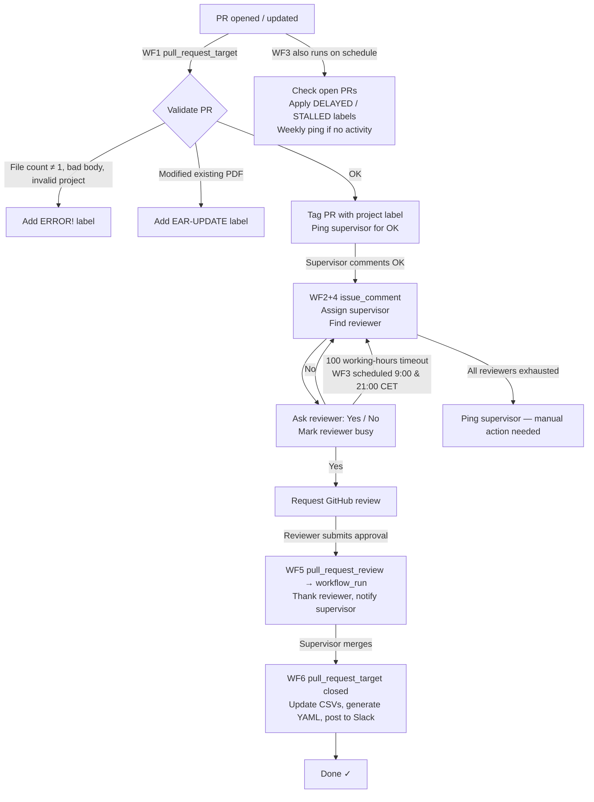

# EAR bot

Automates peer review of ERGA Assembly Reports (EARs) via GitHub Actions. The bot selects supervisors and reviewers, tracks their workload, and updates data files automatically. For EAR creation and submission instructions, see the [Wiki](https://github.com/ERGA-consortium/EARs/wiki).

---

## Lifecycle diagram



> **Concurrency:** WF1, WF2+4, and WF6 share the group `ear-bot-pr-{PR_NUMBER}` with `cancel-in-progress: false`, so runs for the same PR are serialised. WF5 uses a two-step artifact pattern: the first step (`pull_request_review` event) saves PR data to an artifact without secrets; the second step (`workflow_run` event) reads the artifact and runs the bot with the GitHub App token.

---

## Workflows

| # | File | Trigger | Bot flag | Action |
|---|------|---------|----------|--------|
| 1 | `1_ear_bot_pr.yml` | `pull_request_target` [opened, reopened, synchronize, edited] on `Assembly_Reports/**/*.pdf` | `--supervisor` | Validate PR, apply label, find & ping supervisor |
| 2+4 | `2+4_ear_bot_comment.yml` | `issue_comment` [created] (PR only, with project label) | `--comment` | Handle OK / Yes / No / CLEAR; find next reviewer |
| 3 | `3_ear_bot_reviewer.yml` | `schedule` (09:00 & 21:00 CET) + `workflow_dispatch` | `--search` | Timeout check, next reviewer, DELAYED/STALLED labels |
| 5a | `5_ear_bot_approved.yml` | `pull_request_review` [submitted, approved] | — | Save PR_NUMBER + REVIEWER to artifact |
| 5b | `5_ear_bot_approved_comment.yml` | `workflow_run` on WF5a [completed] | `--approve` | Read artifact, thank reviewer, notify supervisor |
| 6 | `6_ear_bot_merge.yml` | `pull_request_target` [closed] | `--merge` | Update CSVs, generate YAML, post Slack (ERGA-BGE only) |

---

## Bot commands

| Who | When | Command | Effect |
|-----|------|---------|--------|
| Supervisor | After bot pings them | `OK` | Supervisor is assigned; bot immediately searches for a reviewer |
| Reviewer | After bot asks them | `Yes` | Reviewer is formally requested; all previously-pinged-but-declined reviewers are unbusy'd |
| Reviewer | After bot asks them | `No` | Bot moves to the next candidate |
| Supervisor | After PR is **closed** | `@erga-ear-bot CLEAR` | Clears all labels and sets all asked-reviewers' busy status back to N |

All commands are case-insensitive. Only the first non-quoted line of the comment is checked for Yes/No.

---

## Labels

| Label | Meaning | Set by | Cleared by |
|-------|---------|--------|------------|
| `ERGA-BGE` | Project type BGE | WF1 | WF6 (on close) or CLEAR command |
| `ERGA-Pilot` | Project type Pilot | WF1 | WF6 (on close) or CLEAR command |
| `ERGA-Community` | Project type Community | WF1 | WF6 (on close) or CLEAR command |
| `ERROR!` | Validation problem (bad body, wrong file count, etc.) | WF1 / WF2+4 | WF1 on next valid edit or push |
| `EAR-UPDATE` | PR is modifying an already-approved EAR | WF1 | Manual / WF6 |
| `DELAYED` | Researcher has not commented in ≥ 4 weeks | WF3 | Manual |
| `STALLED` | Nobody has commented in ≥ 4 weeks | WF3 | WF3 when activity resumes |

---

## Reviewer scoring

Reviewer selection is implemented in `rev/get_EAR_reviewer.py` → `select_best_reviewer` / `adjust_score`.

**Eligibility** (hard filters applied before scoring):
- `Active == 'Y'`
- Institution ≠ the submitter's institution (normalised via `normalize_institution`)

**Score calculation** (starting from each reviewer's `Calling Score` in the CSV):

| Adjustment | Condition |
|------------|-----------|
| +50 | `Last Review == 'NA'` (has never reviewed) |
| +50 | Project is `ERGA-BGE` AND reviewer's institution is one of: CNAG, Sanger, Genoscope, SciLifeLab, IZW, UNIFI, UNIBA |
| −5 | Reviewer is also a supervisor (`Supervisor == 'Y'`) |
| −20 × N | Reviewer currently has N working PRs |

**Tiebreakers** (applied in order when multiple candidates share the top adjusted score):
1. Oldest `Last Review` date
2. Fewest `Total Reviews`
3. Random selection

**Score updates on merge** (via `update_reviewers_list`):
- Reviewer: `Calling Score − 1`, `Total Reviews + 1`, `Last Review` = merge date, `Working PRs − 1`
- Reviewers who timed out (wasted the bot's time): `Calling Score + 1`
- All reviewers at the **same institution as the submitter**: `Calling Score + 1`

---

## Data files

### `rev/reviewers_list.csv`

| Column | Description |
|--------|-------------|
| `Github ID` | Reviewer's GitHub username (lowercase) |
| `Full Name` | Display name used in comments and EAR_reviews.csv |
| `Institution` | Affiliation; normalised by `normalize_institution` for comparisons |
| `Supervisor` | `Y` if the person can act as supervisor |
| `Total Reviews` | Cumulative number of completed reviews |
| `Last Review` | Date of most recent review (YYYY-MM-DD) or `NA` |
| `Active` | `Y` if currently accepting reviews |
| `Working PRs` | Number of PRs the reviewer is currently assigned to |
| `Calling Score` | Base score used for selection (higher = called more often) |

The bot auto-commits changes to this file after each reviewer assignment and after each merge.

### `rev/EAR_reviews.csv`

Append-only log of completed reviews. One row per merged PR, written by WF6. Columns: PR URL, species, project tag, requester name/affiliation, reviewer name/affiliation, supervisor name/affiliation, interaction count, open date, approval date, other participants, notes.

---

## Configuration & secrets

| Name | Where | Description |
|------|-------|-------------|
| `APP_PRIVATE_KEY` | Repository secret | Private key for GitHub App ID 917566 (`erga-ear-bot`). Used to generate a short-lived token with write access to the repo |
| `SLACK_TOKEN` | Repository secret | Slack Bot OAuth token for posting merge announcements |
| `SLACK_CHANNEL_ID` | Hardcoded in WF6 | `C070UHJ80Q3` (#wp9-assembly-delivery). Change directly in `6_ear_bot_merge.yml` if needed |
| `GITHUB_APP_TOKEN` | Injected at runtime | Generated by `actions/create-github-app-token`; passed via env var to the Python script |

**Python dependencies** (`ear_bot/requirements.txt`): `PyGithub`, `pytz`, `slack_sdk`, `pdfplumber`, `pyyaml`

---

## Troubleshooting

**Bot not responding to a new PR**
Check that the PDF is under `Assembly_Reports/` and that only one file was changed. WF1 only fires on `Assembly_Reports/**/*.pdf` paths.

**`ERROR!` label won't clear**
WF1 clears `ERROR!` automatically when the PR body is edited (if the body is now valid) or when a new commit is pushed (if the file-count issue is resolved). If neither applies, a supervisor can remove the label manually.

**Reviewer asked but no response / deadline passed**
WF3 runs twice daily and calls `find_reviewer` with a deadline check. If 100 working hours have elapsed since the last "do you agree to review" comment, it moves to the next candidate automatically. No manual intervention needed unless all reviewers are exhausted.

**All reviewers exhausted**
The bot posts an error comment and adds `ERROR!`. The supervisor must manually assign a reviewer via GitHub's review-request UI, then clear `ERROR!` manually.

**Workflow concurrency / queued runs**
All PR-specific workflows share the concurrency group `ear-bot-pr-{PR_NUMBER}` with `cancel-in-progress: false`. Runs are queued, not cancelled. If a run seems stuck, check the Actions tab for a queued job on the same PR.

**Slack post not appearing**
WF6 only posts to Slack for `ERGA-BGE` PRs. Verify `SLACK_TOKEN` and `SLACK_CHANNEL_ID` are set and correct. The channel ID is hardcoded; the token must be a repository secret named `SLACK_TOKEN`.

**`DELAYED` or `STALLED` label appeared**
`DELAYED` means the submitter hasn't commented in 4 weeks. `STALLED` means no-one has. Both are set by WF3. `STALLED` is automatically removed when any non-bot comment appears. `DELAYED` must be removed manually after activity resumes.

---

## Developer setup

```bash
git clone https://github.com/ERGA-consortium/EARs.git
cd EARs
uv pip install -r ear_bot/requirements.txt
```

**Local reviewer selection** (no GitHub App token needed):

```bash
python rev/get_EAR_reviewer.py -i "CNAG" -t ERGA-BGE
python rev/get_EAR_reviewer.py -i "Sanger" --supervisor --user myusername
```

**Full bot logic** requires a `GITHUB_APP_TOKEN` with write access to the repository. The simplest way to test end-to-end is via `workflow_dispatch` on WF3 in a fork with the App installed.
